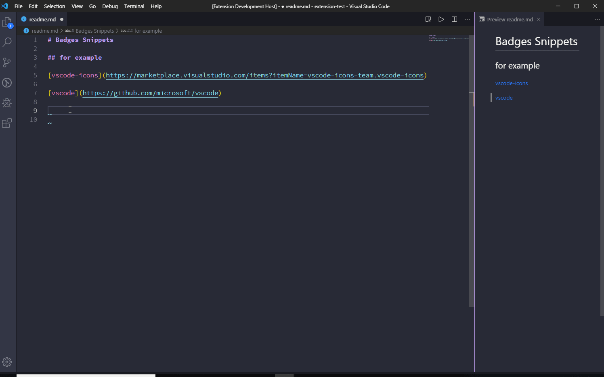
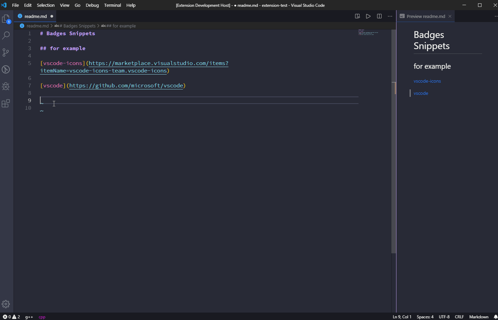

# snippet-badge

[](https://marketplace.visualstudio.com/items?itemName=alexzshl.badges-snippets)
[](https://github.com/relliv/vscode-shieldsio-snippets/blob/master/LICENSE)

Snippets to quickly insert shields.io badges into Markdown documents.

> [!WARNING]  
> This repository forked from [alexzshl/vscode-badges-snippets](https://github.com/relliv/vscode-shieldsio-snippets/tree/dev) and **it is not official shields.io extension.**

## Preview





## Features

- Static badge with list of color/style/logo
- Quick and easy service support
- Quickly generate badges using clipboard data

## Extension Settings

If the snippets for markdown doesn't work, please add the following settings in settings.json:

```json
  "[markdown]": {
    "editor.quickSuggestions": {
      "other": true,
      "comments": true,
      "strings": true,
    }
  }
```

## Usages

Enter the full name or shorthand for the code snippet item, select and press the tab key. Next you need to fill in the placeholders in order.

- `badge static` or `bs` - Create static badge
- `badge vsm version` - Create dynamic badge for an extension on Visual Studio Marketplace
- `badge github stars` - Create dynamic badge for stars of a repository on Github


## Release Notes

### 0.0.2


### 0.0.1

Initial release
